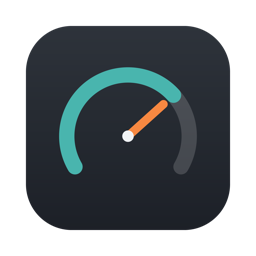
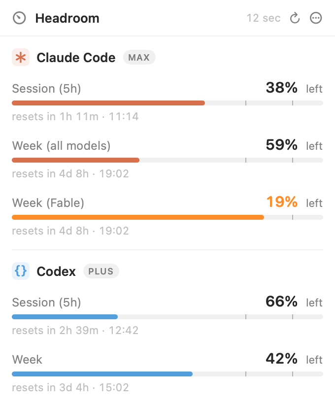
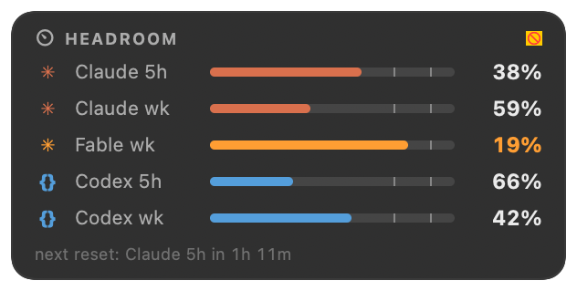

<div align="center">



# Headroom

**Know how much AI coding headroom you have left — before a long run dies at 99%.**

Native macOS menu-bar gauge for Codex (OpenAI) and Claude Code (Anthropic)
rate limits: live percentage in the menu bar, every usage window with its
reset time, floating HUD, threshold alerts. Local-first, zero telemetry.

[](https://github.com/michelepastorello/headroom/releases/latest)
[](https://github.com/michelepastorello/headroom/releases/latest)
[](Package.swift)
[](LICENSE)

[Website](https://headroom.michelepastorello.ai) · [Download](https://github.com/michelepastorello/headroom/releases/latest) · built by [Michele Pastorello](https://michelepastorello.ai)

<picture>
  <source media="(prefers-color-scheme: dark)" srcset="docs/img/dash-dark.png">
  
</picture>

</div>

## Install

**Homebrew**

```sh
brew install michelepastorello/tap/headroom
```

**Direct download** — grab `Headroom-x.y.z.zip` from the
[latest release](https://github.com/michelepastorello/headroom/releases/latest),
unzip, move `Headroom.app` to `/Applications`.

> ⚠️ The current build is ad-hoc signed (not yet notarized). On first launch:
> right-click `Headroom.app` → **Open** → **Open**.

**Build from source** — requires macOS 14+ and Xcode Command Line Tools (Swift 6):

```sh
./build-app.sh     # builds, generates the icon, bundles and signs Headroom.app
open Headroom.app
```

## What you get

- **Live menu-bar percentage** — your tightest window (or both providers), turning orange/red past configurable thresholds
- **Every usage window** — Codex session/week (plus dynamic extras like Spark) and Claude Code session/week/model windows, each with its reset countdown
- **Official APIs, no scraping** — reads the logins your CLIs already have and calls the vendors' own usage endpoints (~300 ms)
- **Floating always-on-top HUD** (⌃⌥J) — keep it over your terminal during long runs
- **Global shortcut** — ⌃⌥H opens the popover from anywhere
- **Threshold notifications** — native alerts before you hit the wall
- **Auto-refresh** (1–15 min) + manual + refresh-on-open, launch at login

<div align="center">

</div>

## Terminal diagnostics

```sh
.build/release/Headroom --check                # prints every window as text
.build/release/Headroom --check --no-keychain  # skip the keychain (file creds only)
.build/release/Headroom --snapshot out.png          # render dashboard, light, demo data
.build/release/Headroom --snapshot out.png --dark   # dark appearance
```

## First launch notes

- Claude Code stores its login in the macOS keychain; Headroom asks for read
  access once. Click **Always Allow**. Denying it just marks Claude as
  unavailable — everything else keeps working.
- The app is ad-hoc signed. For distribution, sign with a Developer ID and
  notarize (`xcrun notarytool`).

## Privacy

Local-first by architecture: Headroom reads the tokens your CLIs already
store and calls only the vendors' own usage endpoints. No telemetry, no
account, no middleman server. Credentials never leave your Mac.

## Layout

```
Sources/Headroom/
  HeadroomApp.swift      entry point, status item, windows, --check, --snapshot
  UsageStore.swift       refresh orchestration, alerts, timers
  Models.swift           providers, windows, severity
  Preferences.swift      user settings (UserDefaults)
  DemoData.swift         fixed data for snapshots
  Providers/             one small file per provider + shared HTTP/parsing
  Views/                 dashboard, settings, onboarding, gauge, theme
scripts/make-icon.swift  draws the app icon with CoreGraphics
```

## Background

Headroom is the evolution of the LimitBar prototype:

|             | LimitBar (prototype)                                        | Headroom                                                                           |
| ----------- | ----------------------------------------------------------- | ---------------------------------------------------------------------------------- |
| Claude data | PTY-scrapes `claude /status` (~15 s, breaks on CLI updates) | Official Anthropic OAuth usage API (~300 ms)                                       |
| Codex data  | Official API                                                | Official API + dynamic extra windows (Spark, …)                                    |
| Menu bar    | Static icon                                                 | Live % of your tightest window, orange/red past thresholds                         |
| Refresh     | Manual only                                                 | Auto-refresh (1–15 min) + manual + refresh-on-open                                 |
| Alerts      | None                                                        | Native notifications at configurable thresholds                                    |
| Login item  | None                                                        | Launch at login (SMAppService)                                                     |
| Appearance  | Forced dark                                                 | Native, adaptive light/dark, popover material                                      |
| Structure   | Single 1000-line main.swift                                 | Modular Swift package, provider layer, testable                                    |
| Extras      | —                                                           | `--check`/`--raw` diagnostics, `--snapshot [--hud]` renderer, onboarding, app icon |
| Widgets     | —                                                           | Floating always-on-top HUD + optional per-provider menu bar items                  |
| Shortcut    | —                                                           | Global ⌃⌥H opens the popover from anywhere                                         |

Not affiliated with OpenAI, Anthropic or SessionWatcher.
